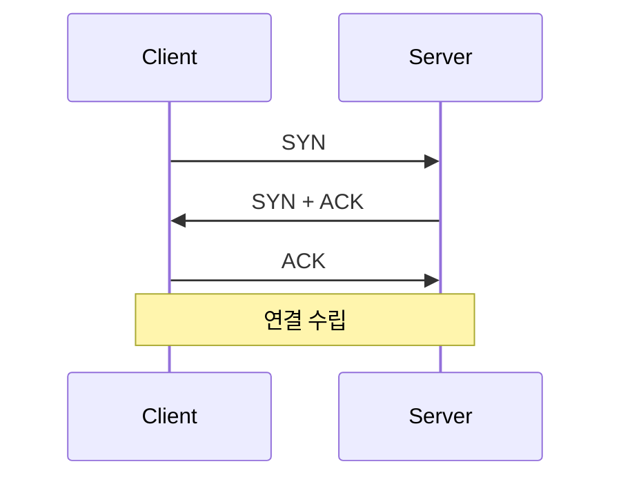

# 문서 형식

형식이 일정하면 읽는 사람이 어디를 봐야 할지 압니다.

## 문서 골격

````markdown
# 캐시 읽기와 쓰기 전략

> Cache-Aside부터 Write-Back까지, 어디에 먼저 쓰는가

## 이 개념을 왜 묻나

면접관이 확인하려는 것. 한두 문장.

## 질문

### Cache-Aside와 Write-Through 중 무엇을 선택하고 왜 그렇게 판단했나요?

<details>
<summary>답변</summary>

결론부터. 그다음 비교표나 도식, 판단 기준, 흔한 실수.

</details>

## 문제로 풀어보기

[](https://learn-foundry.app/guides/cache/cache-strategies?utm_source=github&utm_medium=repo&utm_campaign=oss_questions)

## 관련 개념

- [캐시 일관성 문제](cache-consistency.md)
````

## 답변은 토글 안에 넣습니다

질문은 `###` 제목으로 크게 두고 답변은 `<details>` 로 접습니다.

**왜:** 스스로 답해보기 전에 답이 보이면 연습이 안 됩니다. 목차에서 질문만 훑기도 편합니다.

`<summary>` 다음에 **빈 줄이 있어야** 안쪽 마크다운이 렌더됩니다. 표도 앞뒤로 빈 줄이 필요합니다.

## 답변 안의 순서

| 순서 | 내용 | 필수 |
|------|------|------|
| 정의 | 한두 문장. 결론을 먼저 | 필수 |
| 비교 또는 도식 | 표 또는 mermaid | 권장 |
| 판단 기준 | 실무에서 무엇을 보고 고르나 | 권장 |
| 흔한 실수 | 이렇게 답하면 틀린다 | 필수 |

### 정의는 결론부터, 그리고 대표 용어를 넣는다

```markdown
좋음:  잠금을 걸지 않고 **버전**으로 충돌을 감지하는 방식입니다.
나쁨:  동시성 제어에는 여러 방법이 있습니다. 그중 하나가...
```

**그 기술을 대표하는 용어를 첫 문장에 굵게 넣습니다.** 교과서 용어가 따로 있으면 병기합니다.

독자 제보에서 나온 규칙입니다.

> 기술을 대표하는 핵심 키워드가 없으면 그 기술을 설명할 때 주저리 대는 문제가 생기거든요.

용어가 있으면 그 한 단어로 답을 압축할 수 있고, 없으면 매번 처음부터 풀어 설명하게 됩니다.

| 개념 | 대표 용어 |
|------|-----------|
| 뮤텍스와 세마포어 | 허용 **개수**, **소유권** |
| 가상 메모리 | **논리 주소**와 **주소 변환** |
| 프로세스와 스레드 | **주소 공간**, **자원 공유** |
| 낙관적 락 | **버전**, **충돌 빈도** |
| B-tree | **정렬**, **균형** |

면접관이 쓰는 단어와 우리 문서의 단어가 같아야 합니다. 우리가 "가상 주소"만 쓰고
면접관이 "논리 주소"라고 물으면 아는 것도 못 답합니다.

### 흔한 실수가 이 저장소의 이유입니다

정답을 적은 자료는 많지만 **틀리는 방식**을 적은 자료는 드뭅니다. 조건은 둘입니다.

1. 실제로 사람들이 그렇게 답한다
2. 왜 틀린지 설명이 붙는다

```markdown
좋음:  **흔한 실수:** 낙관적 락이 항상 빠르다고 답하는 것. 충돌이 잦으면
       재시도가 반복되어 잠금 대기보다 느려집니다.
나쁨:  **흔한 실수:** 개념을 정확히 이해하지 못하는 것.
```

두 번째는 아무 정보가 없습니다.

## 도식은 mermaid 로 그립니다

GitHub 이 mermaid 블록을 그림으로 렌더합니다. **ASCII 로 그리지 마세요.**

````markdown

````

한글이 든 도식을 코드블록에 공백으로 맞추면 화면에서 반드시 어긋납니다. 한글 고정폭 글꼴이 없어 프로포셔널로 대체되기 때문입니다. mermaid 는 그림이라 이 문제가 없습니다.

자주 쓰는 것은 셋입니다.

| 무엇을 보여주나 | mermaid 종류 |
|-----------------|--------------|
| 시간 순서, 주고받는 메시지 | `sequenceDiagram` |
| 분기, 판단 흐름 | `flowchart TD` |
| 상태 변화 | `stateDiagram-v2` |

**표로 되는 것은 표로 씁니다.** 두 개를 비교하는 데 도식은 과합니다.

## 코드블록

| 규칙 | 이유 |
|------|------|
| 한글로 열을 맞추지 않는다 | 화면에서 어긋난다. 표를 쓴다 |
| 블록 전체를 들여쓰지 않는다 | 왼쪽에 뜻 없는 여백이 생긴다 |
| 역슬래시를 `\\` 로 쓰지 않는다 | 코드블록 안에서는 이스케이프가 처리되지 않아 두 개로 보인다 |
| 언어 태그를 붙인다 | `sql`, `python`, `bash`. 문법 강조가 붙는다 |

## 문장

| 피할 것 | 이유 |
|---------|------|
| em dash(—), 중간점(·) | 한국어 문서에서 어색하고 AI 가 쓴 티가 난다 |
| ✅ ❌ ⚠ ⭐ | 플랫폼마다 모양이 다르고 같은 기호가 표마다 다른 뜻이 된다 |
| "매우", "정말", "굉장히" | 없어도 뜻이 같다 |
| 개수 표기("질문 4개") | 늘어날 때마다 고쳐야 하고 아무도 안 고친다 |

숫자는 근거가 있을 때만 씁니다.

## 검사

```bash
python3 scripts/check_format.py
python3 scripts/build_index.py     # README 목차 갱신
```
