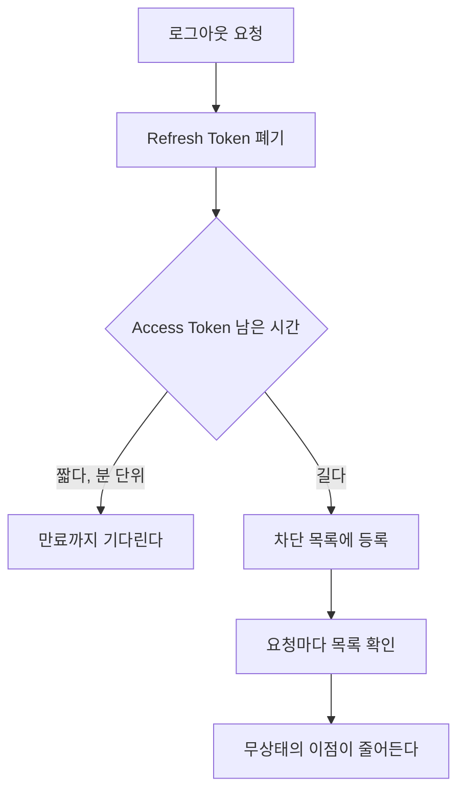

# 세션 인증과 JWT

> 상태를 서버에 둘까, 토큰에 담을까

## 이 개념을 왜 묻나

가장 자주 나오는 설계 질문입니다. JWT 를 "요즘 방식"으로 답하는지, **무상태의 대가**를 아는지가 갈립니다. 로그아웃을 어떻게 처리하냐는 꼬리 질문이 거의 항상 붙습니다.

## 질문

### 세션 인증과 JWT 중 무엇을 고르고 왜 그렇게 판단했나요?

답변

기준은 **즉시 무효화가 필요한가**입니다.

| 항목 | 세션 | JWT |
|------|------|-----|
| 상태 저장 | 서버(또는 Redis) | 토큰 자체 |
| 서버 확장 | 세션 저장소를 공유해야 한다 | 검증만 하면 되어 쉽다 |
| 즉시 로그아웃 | 세션을 지우면 끝 | 만료까지 유효하다 |
| 크기 | 쿠키에 식별자만 | 헤더마다 토큰 전체 |
| 권한 변경 반영 | 즉시 | 재발급 전까지 옛 권한 |

**판단 기준:** 관리자 강제 로그아웃, 권한 회수, 탈취 대응이 필요하면 세션이 단순합니다. 서버가 여럿이고 인증 검증 비용을 줄이는 게 중요하면 JWT 가 맞습니다.

실무에서는 섞습니다. Access Token 은 짧게(분 단위) JWT 로, Refresh Token 은 서버에 상태를 두고 관리합니다.

**흔한 실수:** JWT 가 세션보다 안전하다고 답하는 것. 안전성이 아니라 **상태를 어디에 두는가**의 차이입니다. 오히려 탈취된 JWT 는 만료까지 막을 수 없어 대응이 어렵습니다.

### JWT 를 쓰면서 로그아웃을 어떻게 구현하나요?

답변

토큰 자체를 회수할 수 없으므로 **서버에 상태를 조금 되돌립니다.**

| 방법 | 대가 |
|------|------|
| Access Token 을 짧게 | 재발급 요청이 늘어난다 |
| 차단 목록(blocklist) | 요청마다 조회가 생겨 무상태가 아니게 된다 |
| 토큰 버전 필드 | 사용자 단위 회수는 되지만 조회는 여전히 필요 |

**판단 기준:** 첫 번째가 기본입니다. Access Token 을 5~15분으로 두면 차단 목록 없이도 피해 창이 짧습니다.

**흔한 실수:** 클라이언트에서 토큰을 지우는 것을 로그아웃이라 답하는 것. 이미 유출된 토큰은 그대로 유효합니다.

### Refresh Token 은 어디에 저장해야 하나요?

답변

**HttpOnly 쿠키**입니다. 자바스크립트가 읽을 수 없어야 합니다.

| 저장 위치 | XSS 에 취약 | CSRF 에 취약 |
|-----------|-------------|--------------|
| localStorage | 취약. 스크립트가 읽는다 | 안전 |
| HttpOnly 쿠키 | 안전 | 대비 필요 |

쿠키를 쓰면 CSRF 대비가 필요합니다. `SameSite=Strict` 또는 `Lax` 와 CSRF 토큰을 함께 씁니다. 그리고 재발급 경로에서만 쿠키를 받게 범위를 좁힙니다.

**판단 기준:** XSS 는 한 번 뚫리면 토큰을 전부 가져갈 수 있고 CSRF 는 요청 위조에 그칩니다. 그래서 **XSS 를 먼저 막는 선택**이 낫습니다.

**흔한 실수:** localStorage 가 CSRF 에 안전하니 더 낫다고 답하는 것. 위험의 크기가 다릅니다.

## 문제로 풀어보기

## 관련 개념

- [HTTP 상태 코드와 에러 응답 설계](http-status-and-error-design.md)
- [HTTPS 와 TLS](../network/https-and-tls.md)
