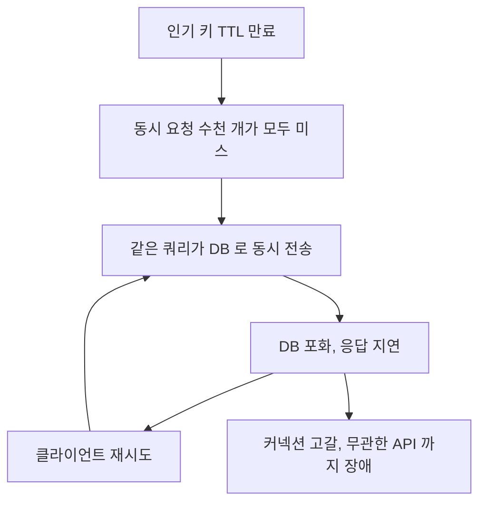

# 캐시 스탬피드 (Thundering Herd)

> TTL 만료 순간 DB로 몰리는 요청 폭발 막기

## 이 개념을 왜 묻나

장애를 겪어본 사람과 안 겪어본 사람이 가장 크게 갈리는 질문입니다. 캐시가 성능 장치가 아니라 **의존성**이라는 것을 아는지 봅니다.

## 질문

### 캐시 스탬피드가 왜 장애로 이어지나요?

답변

인기 키가 만료되는 순간 **그 키를 기다리던 요청이 전부 DB 로 몰립니다.**

| 순서 | 벌어지는 일 |
|------|------------|
| 1 | 인기 키의 만료 시각이 지난다 |
| 2 | 그 사이 도착한 수천 요청이 모두 미스가 된다 |
| 3 | 전부 같은 쿼리를 DB 에 보낸다 |
| 4 | DB 가 포화되어 응답이 느려진다 |
| 5 | 느려진 만큼 대기 요청이 더 쌓인다 |

히트율 99%로 평온하던 서비스가 **한 키 때문에** 무너집니다. 초당 5,000 조회가 그대로 DB 로 가면 평소 부하의 수십 배입니다.

증폭되는 고리가 이렇게 생깁니다.

여기에 재시도와 타임아웃이 겹치면 증폭됩니다. 느려진 응답에 클라이언트가 재시도하고, 그것이 다시 부하가 됩니다.

**흔한 실수:** 히트율이 높으니 안전하다고 보는 것. 스탬피드는 평균이 아니라 **한순간의 동시 미스**가 원인이라 평소 지표로는 보이지 않습니다.

### TTL 만료가 몰리는 문제를 어떻게 막나요?

답변

TTL 에 **지터**를 섞어 만료를 흩뿌리고, 미스가 나도 **단일 갱신**(한 요청만 DB 로)으로 막습니다.

| 방법 | 내용 |
|------|------|
| 만료에 편차 추가 | 3600초 대신 3300에서 3900초 사이로 무작위 |
| 잠금으로 직렬화 | 첫 요청만 갱신하고 나머지는 옛 값이나 대기 |
| 미리 갱신 | 만료 전에 백그라운드로 새로 채운다 |
| 옛 값 허용 | 만료된 값을 잠시 내주면서 뒤에서 갱신한다 |
| 논리적 만료 | 값 안에 만료 시각을 두고, 지나면 한 요청만 갱신을 맡는다 |

배포 직후가 특히 위험합니다. 캐시를 한꺼번에 워밍하면 만료 시각이 모두 같아져 정확히 한 시간 뒤 동시 만료가 옵니다. 워밍할 때도 편차를 넣어야 합니다.

**흔한 실수:** 편차만 넣고 끝내는 것. 편차는 만료가 겹치는 것을 줄이지만, 인기 키 하나에 몰리는 동시 미스는 여전히 남습니다. 잠금이나 옛 값 허용을 함께 둡니다.

### 분산 락으로 갱신을 직렬화할 때 주의할 점은?

답변

| 주의 | 내용 |
|------|------|
| 만료를 반드시 둔다 | 잠금을 쥔 프로세스가 죽으면 영구히 막힌다 |
| 소유자 확인 후 해제 | 남의 잠금을 풀지 않게 값에 식별자를 넣는다 |
| 대기 요청의 행동을 정한다 | 기다릴지, 옛 값을 줄지, 실패로 응답할지 |
| 잠금 대기가 새 병목이 되지 않게 | 대기 시간에 상한을 둔다 |
| 갱신 작업이 만료보다 오래 걸릴 수 있다 | 그 경우 잠금이 풀려 두 요청이 갱신한다 |

세 번째가 사용자 경험을 가릅니다. 모두 기다리게 하면 그 시간만큼 응답이 늦어지므로, **옛 값을 내주면서 뒤에서 갱신하는 방식**이 대개 낫습니다.

다섯 번째는 완전히 막을 수 없습니다. 갱신이 중복돼도 결과가 같으면 문제가 되지 않으므로, 갱신 작업 자체를 여러 번 해도 안전하게 만드는 편이 현실적입니다.

**흔한 실수:** 만료 없는 잠금을 두는 것. 배포나 장애로 프로세스가 죽으면 그 키가 영구히 갱신되지 않습니다.

### 배포 직후 트래픽을 안전하게 받으려면 무엇을 준비하나요?

답변

캐시가 비어 있는 상태로 전체 트래픽을 받지 않게 합니다.

| 준비 | 내용 |
|------|------|
| 사전 워밍 | 인기 키를 미리 채운 뒤 트래픽을 넣는다 |
| 점진 투입 | 카나리로 일부 트래픽만 먼저 보낸다 |
| 만료에 편차 | 워밍한 키가 동시에 만료되지 않게 |
| 요청 병합 | 같은 키의 동시 미스를 하나로 묶는다 |
| DB 보호 | 동시 조회 제한과 차단기를 켜둔다 |

캐시를 외부(Redis)에 두면 배포가 캐시를 비우지 않으므로 이 문제가 대부분 사라집니다. 반대로 프로세스 메모리에 캐시를 두면 **배포마다 전부 비워집니다.**

무엇을 워밍할지는 지표로 정합니다. 조회 상위 키 목록을 뽑아 그것만 채우면 대부분의 효과가 납니다.

**흔한 실수:** 워밍을 전체 데이터로 하는 것. 시간이 오래 걸리고 대부분은 안 읽힙니다. 상위 키만으로 충분합니다.

## 문제로 풀어보기

