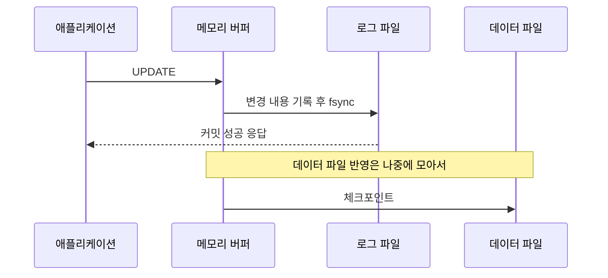

# 트랜잭션과 ACID

> 전부 되거나 전부 안 되게 묶는 것

## 이 개념을 왜 묻나

네 글자를 외웠는지가 아니라 **각 보장이 무엇을 막아주는지** 아는지 봅니다. Durability 를 "저장된다"로만 답하면 로그 이야기로 이어지지 못합니다.

## 질문

### ACID 를 각각 설명하고, 어떤 문제를 막아주는지 말해주세요.

답변

네 낱말이 각각 다른 사고를 막습니다. **원자성**, **일관성**, **격리성**, **지속성**입니다.

| 보장 | 무엇을 막나 | 없으면 벌어지는 일 |
|------|-------------|--------------------|
| Atomicity | 부분 반영 | 출금은 됐는데 입금이 안 된다 |
| Consistency | 규칙 위반 | 재고가 음수가 된다 |
| Isolation | 동시 실행 간 간섭 | 남의 미완성 데이터를 읽는다 |
| Durability | 커밋 후 유실 | 성공 응답을 받았는데 재시작하니 없다 |

Atomicity 는 **되돌릴 수 있게** 하는 것이고, Durability 는 **되돌아가지 않게** 하는 것입니다. 방향이 반대입니다.

**흔한 실수:** Consistency 를 "데이터가 일치한다"로 답하는 것. 여기서 말하는 일관성은 **제약 조건과 규칙을 지킨다**는 뜻입니다. 분산 시스템에서 말하는 일관성(CAP 의 C)과 다른 개념입니다.

### 커밋했는데 서버가 바로 죽어도 데이터가 남는 이유는?

답변

데이터 파일보다 **로그를 먼저 디스크에 씁니다**(WAL, write-ahead logging).

재시작하면 로그를 읽어 커밋된 것은 다시 적용하고(redo), 커밋 안 된 것은 되돌립니다(undo).

**판단 기준:** 로그를 순차 쓰기로 모으기 때문에 빠릅니다. 데이터 파일을 매번 무작위 위치에 쓰면 디스크가 훨씬 느립니다.

**흔한 실수:** 커밋 시점에 데이터 파일까지 쓴다고 답하는 것. 그러면 커밋마다 무작위 쓰기가 생겨 성능이 나오지 않습니다. `fsync` 를 어디에 하는지가 핵심입니다.

### 트랜잭션을 길게 잡으면 무엇이 문제인가요?

답변

잠금과 되돌리기용 데이터를 **그 시간만큼 붙잡습니다.**

| 문제 | 내용 |
|------|------|
| 잠금 대기 | 같은 행을 건드리는 다른 트랜잭션이 밀린다 |
| 되돌리기 기록 누적 | 옛 버전을 계속 보관해 저장 공간과 조회가 무거워진다 |
| 커넥션 점유 | 풀이 마르면 무관한 API 까지 실패한다 |
| 데드락 확률 | 잠금을 오래 쥘수록 순환이 생길 창이 커진다 |

가장 흔한 원인은 트랜잭션 안에서 **외부 호출**을 하는 것입니다. 결제 API 응답이 3초 늦으면 그 3초 동안 잠금이 유지됩니다.

**판단 기준:** 트랜잭션 경계는 DB 작업만 감싸고, 외부 호출은 밖으로 뺍니다. 뺄 수 없으면 상태를 먼저 기록하고 나중에 처리합니다.

**흔한 실수:** 트랜잭션을 넓게 잡는 것이 안전하다고 답하는 것. 정합성은 좋아 보이지만 처리량이 무너지고 데드락이 늘어납니다.

## 문제로 풀어보기

## 관련 개념

- [트랜잭션 격리 수준](isolation-levels.md)
- [데드락](database-deadlock.md)
