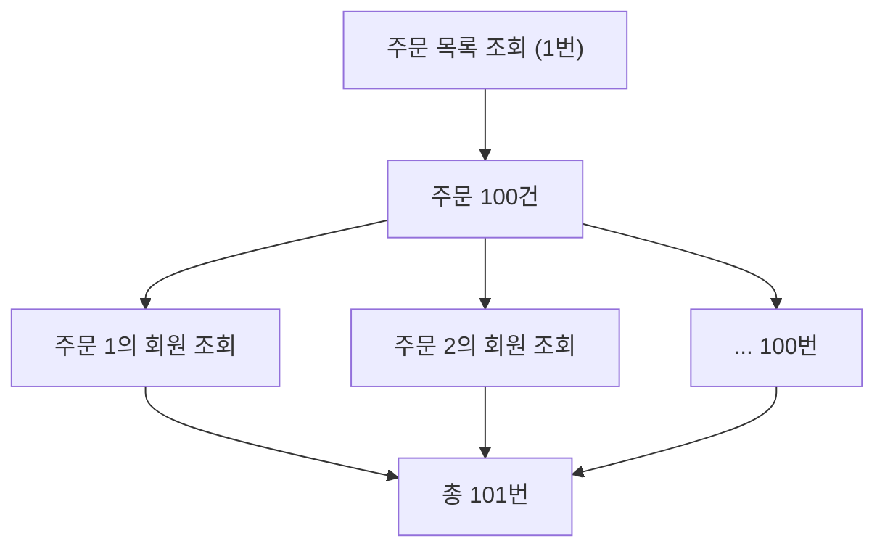

# N+1 쿼리 문제

> 목록 하나를 그리려고 쿼리를 101번 보내는 일

## 이 개념을 왜 묻나

ORM 을 실제로 써봤는지 가장 빨리 드러나는 질문입니다. 이름만 아는지, **어떻게 발견하고 무엇으로 고쳤는지** 말할 수 있는지가 갈립니다.

## 질문

### N+1 문제가 무엇이고 왜 생기나요?

답변

목록을 한 번 조회한 뒤, **각 행의 연관 데이터를 건마다 다시 조회**하는 것입니다.

지연 로딩(lazy loading)이 기본값이라 생깁니다. 코드에서는 `order.getMember().getName()` 한 줄이지만 그 줄이 쿼리 한 번입니다. 루프 안에 있으면 건수만큼 늘어납니다.

**판단 기준:** 쿼리 수가 데이터 건수에 비례하면 N+1 입니다. 개발 환경에서는 10건이라 안 보이고 운영에서 1만 건이 되면 드러납니다.

**흔한 실수:** 성능이 느린 문제로만 답하는 것. 커넥션 점유와 DB 부하가 함께 늘어나 **다른 요청까지 느려집니다.** 느린 API 하나가 아니라 장애로 번지는 종류입니다.

### 어떻게 발견하나요?

답변

쿼리 로그를 켜고 **요청 하나가 만드는 쿼리 수**를 셉니다.

| 방법 | 무엇을 보나 |
|------|-------------|
| SQL 로그 | 같은 형태의 쿼리가 반복되는가 |
| 요청당 쿼리 수 지표 | 건수에 비례해 늘어나는가 |
| APM 트레이스 | 한 트랜잭션 안의 DB 호출 개수 |

같은 모양의 쿼리가 파라미터만 바뀌며 반복되면 확정입니다.

**판단 기준:** 사후에 찾기보다 **요청당 쿼리 수에 상한을 두고 테스트에서 깨뜨리는 것**이 낫습니다. 코드 리뷰로는 잘 안 잡힙니다.

**흔한 실수:** 응답 시간만 보는 것. 데이터가 적은 개발 환경에서는 101번이 빨라서 지표가 정상으로 보입니다.

### 어떻게 해결하나요?

답변

한 번에 가져오도록 바꿉니다. 상황에 따라 방법이 다릅니다.

| 방법 | 언제 | 주의 |
|------|------|------|
| 조인해서 한 번에 조회 | 연관이 단일(주문 -> 회원) | 컬럼이 늘어 전송량이 커진다 |
| IN 절로 묶어 조회 | 컬렉션(주문 -> 상품 목록) | 두 번의 쿼리로 끝난다 |
| 배치 크기 설정 | ORM 이 지원할 때 | 건수가 크면 IN 절이 길어진다 |
| 필요한 필드만 조회 | 목록 화면 | 엔티티 대신 DTO 로 받는다 |

컬렉션 두 개를 동시에 조인하면 행이 곱해집니다(카테시안 곱). 그때는 조인 대신 **IN 절로 나눠 가져오는 쪽**이 맞습니다.

**흔한 실수:** 모든 연관을 즉시 로딩으로 바꾸는 것. N+1 은 사라지지만 **쓰지 않는 데이터까지 항상 조회**해 다른 화면이 느려집니다. 기본은 지연 로딩으로 두고 필요한 조회에서만 함께 가져옵니다.

## 문제로 풀어보기

## 관련 개념

- [B-tree 인덱스](btree-index.md)
- [복합 인덱스](composite-index.md)
