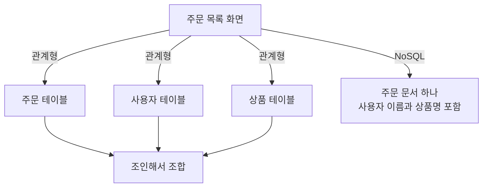
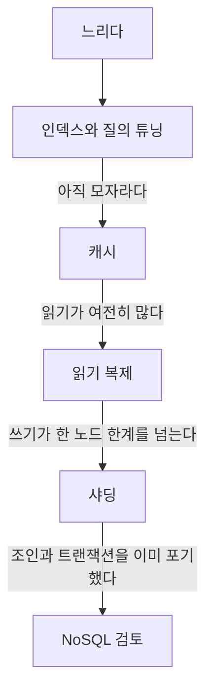

# RDB vs NoSQL

> 무엇을 포기하고 무엇을 얻었는지로 답하는 질문

## 이 개념을 왜 묻나

지원자가 저장소를 **고른 이유**를 말할 수 있는지 봅니다. "NoSQL이 빠르다"로 끝나면 트레이드오프를 모르는 것으로 읽힙니다.

## 질문

### RDB와 NoSQL의 차이를 설명해주세요

답변

관계형은 **스키마**로 정합성을 지키고 **조인**으로 흩어진 데이터를 모읍니다. NoSQL은 이 둘을 내려놓는 대신 **수평 확장**을 얻습니다.

| 항목 | 관계형 | NoSQL |
|------|--------|-------|
| 스키마 | 미리 정의한다. 어긋난 데이터는 거부된다 | 유연하다. 항목마다 필드가 달라도 된다 |
| 조인 | 질의할 때 조합한다 | 대개 없다. 쓸 때 미리 합쳐 둔다 |
| 확장 | 수직이 기본. 샤딩은 추가 설계 | 수평이 기본 |
| 트랜잭션 | 여러 행에 걸쳐 보장한다 | 문서 하나 단위가 흔하다 |
| 일관성 | 즉시 | 최종 일관성인 경우가 많다 |

**왜 조인을 포기하면 수평 확장이 쉬워지나요.** 조인이 필요하면 관련 데이터가 같은 노드에 있어야 합니다. 노드를 늘릴수록 그 보장이 어려워집니다. 조인을 버리면 데이터를 키로 잘라 아무 노드에나 흩어 놓을 수 있습니다.

**판단 기준:** 어느 쪽이 좋은 것이 아니라 무엇을 포기할 수 있는지의 문제입니다. 돈이나 재고처럼 틀리면 안 되는 값은 트랜잭션이 필요하고, 질의 모양을 미리 다 알 수 없으면 조인이 필요합니다.

**흔한 실수:** NoSQL이 더 빠르다고 답하는 것. 같은 조건이면 오히려 느릴 수도 있습니다. 빠른 이유는 엔진이 아니라 **조인과 즉시 일관성을 포기한 설계**입니다. 무엇을 포기했는지 말하지 못하면 이유를 설명한 것이 아닙니다.

### NoSQL로 옮기면 데이터 모델링이 어떻게 달라지나요

답변

**질의 모양을 먼저 정하고 그 모양대로 저장합니다.** 관계형은 반대로 정규화해 두고 질의할 때 조합합니다.

읽기는 한 번으로 끝나 빨라집니다. 대가는 중복입니다. 사용자가 이름을 바꾸면 그 이름이 박혀 있는 주문 문서를 모두 찾아 고쳐야 합니다.

**판단 기준:** 바뀌는 빈도와 시점 값 보존 여부를 봅니다.

| 데이터 성격 | 처리 |
|-------------|------|
| 주문 당시의 상품명, 영수증, 계약 | 중복이 오히려 정확하다. 그대로 박아 둔다 |
| 프로필 표시용 닉네임 | 참조로 두고 읽을 때 조합하거나 변경 시 갱신한다 |

**흔한 실수:** 스키마가 없으니 설계가 필요 없다고 답하는 것. 스키마 정의를 데이터베이스가 강제하지 않을 뿐이고 설계는 애플리케이션으로 옮겨온 것입니다. 강제가 없으니 실제로는 더 신중해야 합니다.

### 결제나 재고 데이터를 NoSQL에 두면 어떤 문제가 생기나요

답변

**여러 문서에 걸친 변경을 한 번에 되돌릴 수 없습니다.**

재고를 줄이고 결제를 기록하는 두 작업이 서로 다른 문서라면, 하나만 성공한 상태가 생깁니다. 관계형은 트랜잭션으로 둘을 묶어 실패 시 함께 되돌립니다.

| 나타나는 문제 | 모습 |
|---------------|------|
| 부분 성공 | 재고는 줄었는데 결제 기록이 없다 |
| 이중 차감 | 재시도가 같은 작업을 두 번 반영한다 |
| 최종 일관성 | 방금 줄인 재고를 다른 노드에서 아직 옛 값으로 읽는다 |

우회 방법은 있습니다. 한 문서에 함께 담아 단일 문서 원자성을 쓰거나, 보상 처리로 실패를 되돌리거나, 멱등 키로 재시도를 막습니다. 다만 전부 **애플리케이션이 직접 만들어야 하는 것**입니다.

**흔한 실수:** 요즘 NoSQL도 트랜잭션을 지원한다고 답하고 끝내는 것. 지원 범위와 성능 대가가 제품마다 다르고 샤드를 넘는 트랜잭션은 비싸거나 제약이 붙습니다. 지원 여부보다 **어디까지 보장되는지**를 말해야 합니다.

### 관계형도 확장할 수 있는데 NoSQL로 넘어가는 기준은 무엇인가요

답변

관계형으로 못 버텨서가 아니라, **관계형의 장점을 이미 포기한 시점**입니다.

관계형도 확장합니다. 읽기는 복제로 나누고 쓰기는 샤딩으로 나눕니다. 그런데 샤딩을 하면 샤드를 넘는 조인과 트랜잭션이 어려워집니다. 샤딩을 시작한 순간 NoSQL과 같은 고민을 하고 있는 것입니다.

**판단 기준:** 이 단계를 다 밟고도 모자라고, 질의 모양이 고정적이며 조인이 필요 없을 때입니다.

**흔한 실수:** 데이터가 많으니 NoSQL로 간다고 답하는 것. 양보다 **질의 모양과 쓰기 처리량**이 기준입니다. 수억 행이어도 인덱스가 맞으면 관계형이 잘 처리합니다.

## 문제로 풀어보기

## 관련 개념

- [트랜잭션과 ACID](acid-and-transaction.md)
- [N+1 쿼리 문제](n-plus-one.md)
- [트랜잭션 격리 수준](isolation-levels.md)
