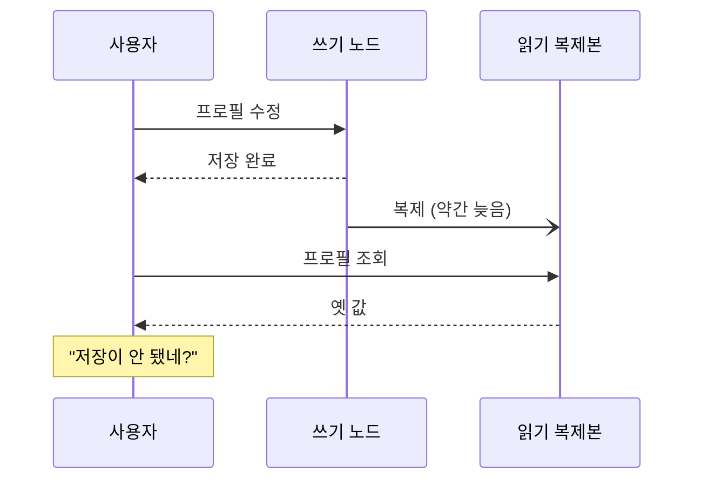
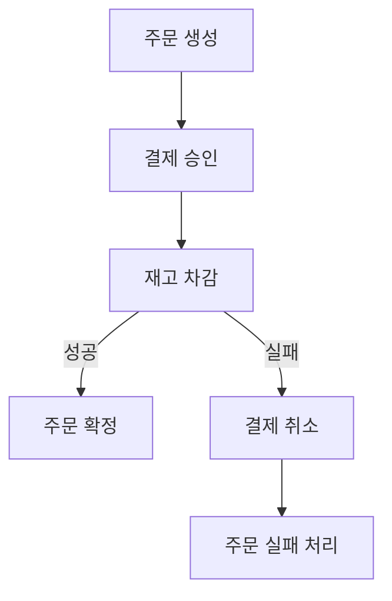

# CAP 정리와 일관성

> 나눠진 순간에만 고르는 문제

## 이 개념을 왜 묻나

외운 것과 이해한 것이 가장 크게 갈리는 질문입니다. "CP 냐 AP 냐" 를 평상시 성격으로 답하면 틀립니다. **분단이 일어난 순간의 선택**이라는 걸 아는지 봅니다.

## 질문

### CAP 정리를 설명해주세요.

답변

네트워크가 나뉘었을 때(P) **일관성(C)과 가용성(A) 중 하나를 포기해야 한다**는 것입니다.

셋 중 둘을 고르는 문제가 아닙니다. 분산 시스템에서 네트워크 분단은 **선택 사항이 아니라 언젠가 일어나는 사실**이므로, 실제 선택지는 두 개뿐입니다.

| 분단이 났을 때 | 선택 | 결과 |
|----------------|------|------|
| 오래된 값을 주지 않는다 | CP | 확실하지 않으면 응답을 거부한다 |
| 일단 응답한다 | AP | 오래된 값을 줄 수 있다 |

평상시에는 둘 다 만족합니다. 그래서 "우리 시스템은 CP" 같은 말은 **분단 상황의 동작**을 뜻합니다.

**판단 기준:** 데이터 성격으로 고릅니다. 잔액이나 재고는 틀린 값을 주면 안 되니 거부하는 쪽이 낫고, 게시글 조회수는 조금 늦어도 무해합니다. **한 서비스 안에서도 데이터마다 다릅니다.**

**흔한 실수:** "3개 중 2개를 고른다"로 답하는 것. P 를 포기한다는 것은 네트워크가 절대 안 끊긴다는 가정이라 분산 시스템에서 성립하지 않습니다. 그리고 CAP 의 C 는 **모든 읽기가 최신 쓰기를 본다**는 뜻이고, ACID 의 C(제약 조건 준수)와 다른 개념입니다.

### 최종 일관성은 실무에서 어떤 문제를 만드나요?

답변

**방금 내가 한 일이 안 보이는** 상황이 생깁니다. 사용자에게는 버그로 보입니다.

| 완화 방법 | 내용 | 대가 |
|-----------|------|------|
| 쓴 뒤 잠시 쓰기 노드에서 읽기 | 본인 쓰기는 본인이 본다 | 쓰기 노드 부하가 늘어난다 |
| 응답에 저장된 값을 실어주기 | 화면은 다시 조회하지 않는다 | 목록으로 돌아가면 다시 어긋난다 |
| 복제 지연 확인 후 라우팅 | 늦은 복제본은 피한다 | 구현이 복잡하다 |

첫 번째가 가장 자주 쓰입니다. 본인이 쓴 것만 최신으로 보이면 대부분의 체감 문제가 사라집니다.

**판단 기준:** 남의 변경이 몇 초 늦는 것은 대개 괜찮고, **자기 변경이 늦는 것은 거의 항상 문제**입니다. 이 구분이 설계의 기준이 됩니다.

**흔한 실수:** 복제 지연을 0으로 만들면 된다고 답하는 것. 동기 복제로 바꾸면 지연은 사라지지만 쓰기가 복제본을 기다려 느려지고, 복제본 하나가 죽으면 쓰기가 막힐 수 있습니다. **지연을 없애는 것이 아니라 지연을 감안해 설계**하는 문제입니다.

### 두 서비스에 걸친 작업의 정합성은 어떻게 맞추나요?

답변

DB 트랜잭션으로 묶을 수 없으므로 **되돌리는 절차를 직접 만듭니다.** 그게 사가(Saga)입니다.

주문에서 결제와 재고 차감이 다른 서비스라면, 하나가 실패했을 때 앞의 것을 보상 작업으로 취소합니다.

| 방식 | 내용 | 언제 |
|------|------|------|
| 오케스트레이션 | 조율자가 순서를 지시한다 | 흐름이 복잡할 때. 추적이 쉽다 |
| 코레오그래피 | 각 서비스가 이벤트를 듣고 반응 | 단계가 적을 때. 결합이 낮다 |

**판단 기준:** 보상 작업이 **정말 되돌릴 수 있는지**를 먼저 봅니다. 결제 취소는 되지만 발송된 메일은 못 되돌립니다. 되돌릴 수 없는 작업은 **맨 마지막**에 두는 것이 원칙입니다.

**흔한 실수:** 2단계 커밋(2PC)으로 답하는 것. 이론적으로는 맞지만 조율자가 죽으면 참여자들이 잠금을 쥐고 멈추고, 서비스 간 결합이 강해져 실무에서는 잘 쓰지 않습니다. 그리고 사가는 **중간 상태가 외부에 보인다**는 점을 함께 말해야 합니다. 결제는 됐고 재고는 아직인 순간이 실제로 존재합니다.

## 문제로 풀어보기

## 관련 개념

- [타임아웃과 재시도, 서킷 브레이커](timeout-retry-circuit-breaker.md)
- [트랜잭션과 ACID](../database/acid-and-transaction.md)
