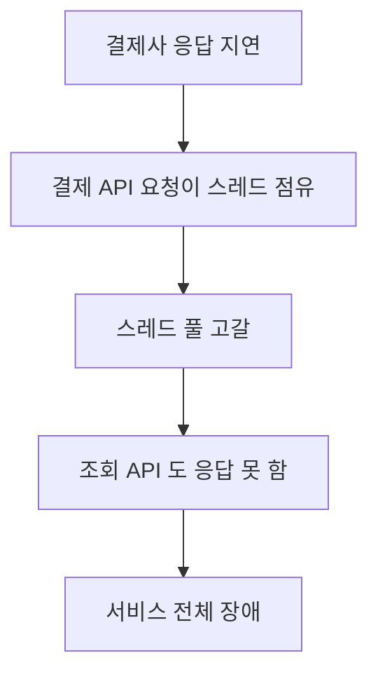
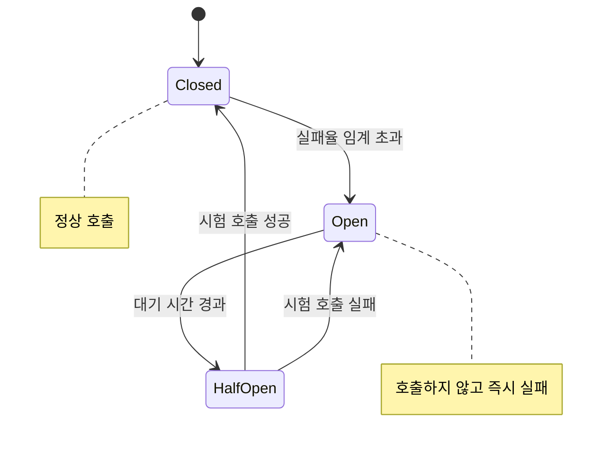

# 타임아웃과 재시도, 서킷 브레이커

> 남의 장애가 내 장애가 되지 않게 하는 것

## 이 개념을 왜 묻나

장애가 번지는 것을 겪어봤는지 드러납니다. 재시도를 "넣으면 좋은 것"으로 답하는지, **재시도가 장애를 키운다**는 것을 아는지가 갈립니다.

## 질문

### 타임아웃을 걸지 않으면 무슨 일이 생기나요?

답변

상대가 느려질 때 **내 스레드와 커넥션이 잡혀 내 서비스가 먼저 죽습니다.**

응답을 기다리는 동안 그 요청은 자원을 쥐고 있습니다. 상대가 10초 걸리면 처리 중인 요청이 10초씩 쌓이고, 스레드 풀이 차면 **상대와 무관한 API 까지 응답하지 못합니다.**

| 설정 | 없으면 |
|------|--------|
| 연결 타임아웃 | 연결 자체가 안 될 때 무한정 기다린다 |
| 응답 타임아웃 | 연결은 됐는데 응답이 안 올 때 무한정 기다린다 |

**판단 기준:** 타임아웃은 상대의 p99 를 근거로 정합니다. 평균으로 잡으면 정상 요청의 절반 가까이가 잘리고, 너무 길게 잡으면 없는 것과 비슷해집니다.

**흔한 실수:** 타임아웃을 넉넉하게 두는 것이 안전하다고 답하는 것. 넉넉한 타임아웃은 **장애를 느리게 전파시킬 뿐** 막지 않습니다. 그리고 호출 사슬이 있으면 안쪽 타임아웃이 바깥보다 짧아야 합니다. 반대면 바깥이 먼저 끊겨 안쪽 작업이 헛돕니다.

### 재시도가 오히려 장애를 키우는 경우는?

답변

상대가 **과부하로 느려졌을 때**입니다. 재시도가 부하를 더 얹습니다.

100개 요청이 실패하고 각자 3번 재시도하면 상대는 400개를 받습니다. 상대는 더 느려지고, 더 많이 실패하고, 더 많이 재시도됩니다.

| 규칙 | 이유 |
|------|------|
| 지수 백오프 | 간격을 늘려 몰아치지 않는다 |
| 지터(무작위) | 같은 순간에 재시도가 겹치지 않게 |
| 멱등한 요청만 | 재시도로 두 번 처리되면 안 되는 것은 제외 |
| 총 시도 횟수 제한 | 3회 정도. 그 이상은 의미가 적다 |

지터가 특히 중요합니다. 백오프만 두면 실패한 요청들이 **같은 시각에 함께 재시도**해서 파도가 됩니다.

**판단 기준:** 사용자가 기다리는 동기 요청은 재시도 여유가 거의 없습니다. 큐로 넘길 수 있으면 재시도는 비동기 쪽에서 하는 것이 낫습니다.

**흔한 실수:** 모든 실패에 재시도를 거는 것. 400 처럼 요청 자체가 잘못된 것은 백 번 해도 실패합니다. **재시도할 수 있는 실패와 아닌 실패를 서버가 구분해 알려줘야** 클라이언트가 판단할 수 있습니다.

### 서킷 브레이커는 무엇을 해결하나요?

답변

**이미 죽은 상대를 계속 부르지 않게** 합니다. 실패가 일정 비율을 넘으면 아예 호출을 끊고 즉시 실패로 답합니다.

얻는 것이 둘입니다. 상대에게 **회복할 틈**을 주고, 내 쪽은 타임아웃을 기다리지 않아 자원을 지킵니다.

**판단 기준:** 끊었을 때 무엇을 돌려줄지가 핵심입니다. 캐시된 옛 값, 기본값, 축소된 기능 중 하나를 정해둡니다. 정해두지 않으면 회로를 열어도 사용자에게는 그냥 에러입니다.

**흔한 실수:** 서킷 브레이커를 넣으면 장애가 전파되지 않는다고 답하는 것. 회로가 열리면 **그 기능은 여전히 안 됩니다.** 전파를 막는 것이지 기능을 살리는 것이 아닙니다. 그리고 회로 상태는 인스턴스마다 따로 계산되므로, 서버 100대면 각자 임계치를 채우며 상대를 두드립니다.

## 문제로 풀어보기

## 관련 개념

- [CAP 정리와 일관성](cap-and-consistency.md)
- [멱등성과 재시도](../api-design/idempotency-and-retry.md)
