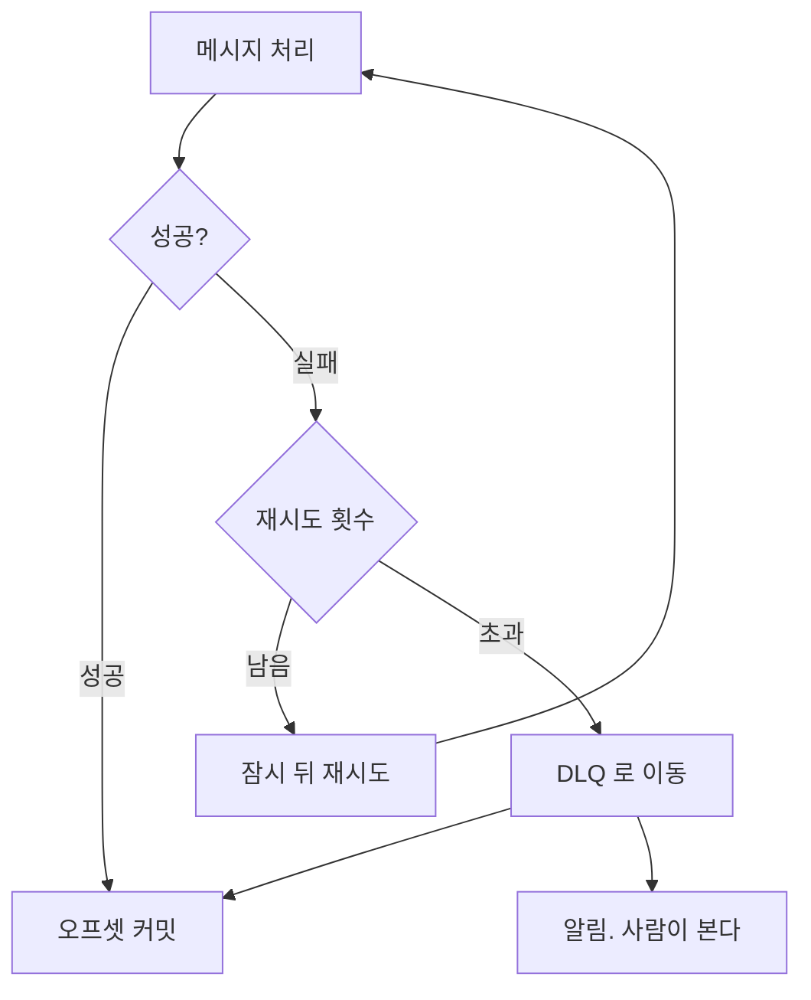

# 컨슈머 랙과 실패 처리

> 쌓이는 것과 못 먹는 것은 다른 문제다

## 이 개념을 왜 묻나

큐를 운영해본 사람인지가 드러납니다. 랙이 왜 쌓이는지 원인을 나눠 말하는지, 실패한 메시지를 어떻게 다뤄봤는지를 봅니다. 무한 재시도로 큐를 막아본 경험이 있으면 답이 구체적입니다.

## 질문

### 컨슈머 랙이 계속 늘어납니다. 무엇부터 확인하나요?

답변

랙은 **들어오는 속도가 처리 속도보다 빠르다**는 한 가지 사실만 말해줍니다. 원인은 셋 중 하나입니다.

| 원인 | 확인 방법 | 대응 |
|------|-----------|------|
| 유입이 늘었다 | 프로듀서 전송량 추이 | 컨슈머를 늘린다 |
| 처리가 느려졌다 | 메시지당 처리 시간 | 병목을 찾는다. 대개 외부 호출이나 DB |
| 컨슈머가 멈췄다 | 처리량이 0에 가까운가 | 재시작. 죽은 원인을 본다 |

세 번째를 먼저 확인해야 합니다. 멈춘 것을 두고 컨슈머를 늘리면 **같은 이유로 새 컨슈머도 멈춥니다.**

병목이 외부 호출이면 컨슈머를 늘려도 안 풀립니다. 상대 서비스나 DB 커넥션이 한계라면 컨슈머만 늘어나 **경합이 심해져 더 느려질 수 있습니다.**

**판단 기준:** 컨슈머 수는 파티션 수를 넘을 수 없습니다. 파티션이 6개면 컨슈머 7번째는 아무것도 받지 못하고 놀게 됩니다. 늘리려면 파티션을 먼저 늘려야 합니다.

**흔한 실수:** 랙을 항상 나쁜 것으로 답하는 것. 배치 유입처럼 순간적으로 몰리는 경우 랙이 생기고 곧 줄어드는 것이 정상입니다. **랙의 절대값보다 줄어드는 추세인지**가 판단 기준입니다.

### 처리에 계속 실패하는 메시지는 어떻게 하나요?

답변

**몇 번 재시도한 뒤 따로 빼둡니다.** 그게 DLQ(Dead Letter Queue)입니다.

빼두지 않으면 그 메시지가 파티션 맨 앞을 막아 뒤의 정상 메시지가 전부 밀립니다.

| 실패 종류 | 재시도 | 이유 |
|-----------|--------|------|
| 일시적 (타임아웃, 5xx) | 한다 | 다음에 성공할 수 있다 |
| 영구적 (형식 오류, 없는 참조) | 하지 않는다 | 백 번 해도 실패한다 |

둘을 구분하지 않으면 형식이 깨진 메시지 하나로 큐가 멈춥니다.

**판단 기준:** DLQ 는 쌓아두는 곳이 아니라 **사람이 보는 곳**입니다. 알림을 걸지 않으면 조용히 유실됩니다. 그리고 재처리 수단을 함께 만들어야 합니다. 고친 뒤 다시 넣을 방법이 없으면 DLQ 는 쓰레기통이 됩니다.

**흔한 실수:** 재시도 횟수만 정하고 간격을 즉시로 두는 것. 상대가 과부하일 때 즉시 재시도는 **부하를 더 얹습니다.** 간격을 점점 늘리고 약간의 무작위를 섞어야 합니다.

### 처리량을 늘리려고 컨슈머를 늘렸는데 효과가 없습니다. 왜일까요?

답변

한계가 컨슈머 수가 아닌 곳에 있습니다. 순서대로 확인합니다.

| 확인 | 증상 |
|------|------|
| 파티션 수 | 컨슈머가 파티션보다 많으면 초과분은 놀고 있다 |
| 처리 병목 | DB 커넥션 풀이나 외부 API 가 한계면 컨슈머를 늘려도 대기만 늘어난다 |
| 키 편중 | 특정 키에 메시지가 몰리면 그 파티션만 바쁘다 |
| 한 번에 가져오는 수 | 너무 작으면 왕복이 잦아 처리량이 안 오른다 |

세 번째가 자주 놓칩니다. 파티션이 6개여도 **특정 사용자의 이벤트가 전체의 절반**이면 그 파티션 하나가 병목입니다. 파티션을 늘려도 같은 키는 같은 파티션으로 가서 안 풀립니다.

**판단 기준:** 파티션별 랙을 따로 봅니다. 전체 랙만 보면 편중을 못 봅니다. 특정 파티션만 쌓이면 키 설계 문제입니다.

**흔한 실수:** 컨슈머 수를 늘리는 것으로 답을 끝내는 것. 병목이 DB 라면 컨슈머가 늘수록 커넥션 경합이 심해져 **처리량이 오히려 떨어집니다.**

## 문제로 풀어보기

## 관련 개념

- [전달 보장과 멱등 소비자](delivery-and-idempotency.md)
- [타임아웃과 재시도, 서킷 브레이커](../distributed-systems/timeout-retry-circuit-breaker.md)
