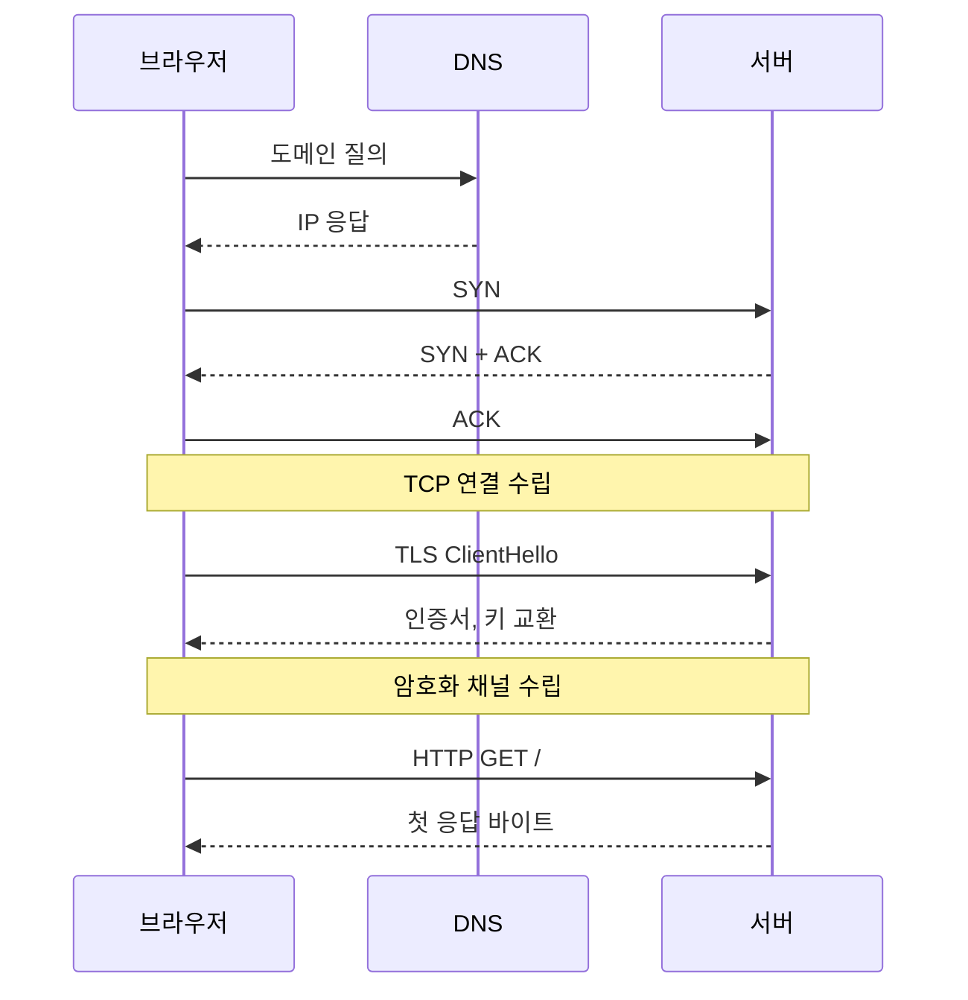
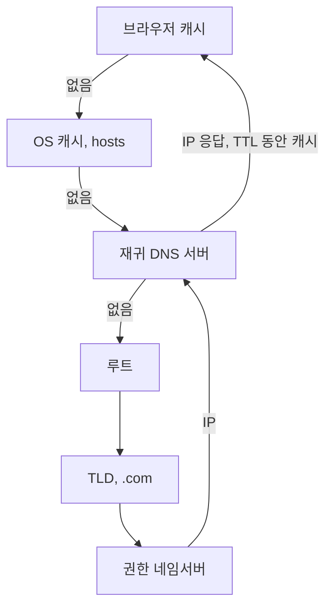

# 주소를 입력하면 무슨 일이 일어나나

> DNS 조회부터 첫 바이트가 도착할 때까지

## 이 개념을 왜 묻나

면접에서 가장 많이 나오는 질문입니다. 답의 길이가 아니라 **어디까지 쪼개서 말하는지**로 깊이가 드러납니다. DNS, TCP, TLS, HTTP 를 각각 다른 계층의 일로 구분하는지 봅니다.

## 질문

### 브라우저에 주소를 입력하고 첫 응답이 오기까지 무슨 일이 일어나나요?

답변

네 단계이고, **각 단계가 왕복(RTT)을 요구한다**는 게 핵심입니다.

| 단계 | 왕복 | 줄이는 방법 |
|------|------|-------------|
| DNS 조회 | 캐시에 있으면 0 | TTL, OS 와 브라우저 캐시 |
| TCP 연결 | 1 | keep-alive 로 재사용 |
| TLS 협상 | TLS 1.3 은 1, 1.2 는 2 | 세션 재개, 0-RTT |
| HTTP 요청과 응답 | 1 | CDN 으로 거리를 줄인다 |

왕복 시간이 100ms 인 경로면 연결만 세우는 데 200~300ms 가 듭니다. 그래서 **연결 재사용이 응답 속도에서 가장 큰 변수**입니다.

**흔한 실수:** "DNS 조회하고 요청 보냅니다"로 끝내는 것. TCP 와 TLS 를 빼면 왜 첫 요청이 느린지, 왜 keep-alive 가 중요한지 설명할 수 없습니다.

### DNS 조회는 어떤 순서로 이루어지나요?

답변

가까운 캐시부터 보고, 없으면 **재귀 질의**로 루트에서 권한 네임서버까지 내려갑니다. 결과는 **TTL** 동안 캐시됩니다.

| 계층 | 무엇을 아는가 |
|------|---------------|
| 루트 | `.com` 을 담당하는 곳 |
| TLD | `example.com` 의 권한 네임서버 |
| 권한 네임서버 | 실제 IP |

재귀 DNS 서버가 이 과정을 대신 밟고 결과를 TTL 동안 캐시합니다. 그래서 대부분의 조회는 한 번의 왕복으로 끝납니다.

**판단 기준:** TTL 을 짧게 두면 장애 시 전환이 빠르지만 조회가 늘어납니다. 배포나 IP 전환을 앞두고 TTL 을 미리 줄여두는 것이 실무 방법입니다.

**흔한 실수:** TTL 을 낮추면 즉시 반영된다고 답하는 것. 중간 리졸버가 TTL 을 무시하거나 더 길게 캐시하는 경우가 있어 **완전한 즉시 전환은 없습니다.**

### 같은 도메인인데 응답이 사람마다 다른 IP 로 오는 이유는?

답변

DNS 가 **부하 분산과 지리적 라우팅**에 쓰이기 때문입니다.

| 방식 | 동작 | 한계 |
|------|------|------|
| 라운드로빈 | 여러 A 레코드를 번갈아 준다 | 죽은 서버도 계속 반환한다 |
| GeoDNS | 요청자 위치에 가까운 IP 를 준다 | 리졸버 위치 기준이라 어긋날 수 있다 |
| 헬스체크 연동 | 죽은 IP 를 목록에서 뺀다 | 캐시된 응답은 TTL 동안 남는다 |

**판단 기준:** DNS 는 부하 분산 도구로 정밀하지 않습니다. 세션이나 가중치가 필요하면 로드밸런서를 앞에 둡니다.

**흔한 실수:** DNS 라운드로빈을 로드밸런서 대체로 답하는 것. 클라이언트가 캐시를 들고 있으므로 **트래픽이 균등하게 나뉘지 않고**, 장애 서버를 즉시 빼지도 못합니다.

## 문제로 풀어보기

## 관련 개념

- [TCP 3-way Handshake](tcp-3way-handshake.md)
- [HTTPS 와 TLS](https-and-tls.md)
