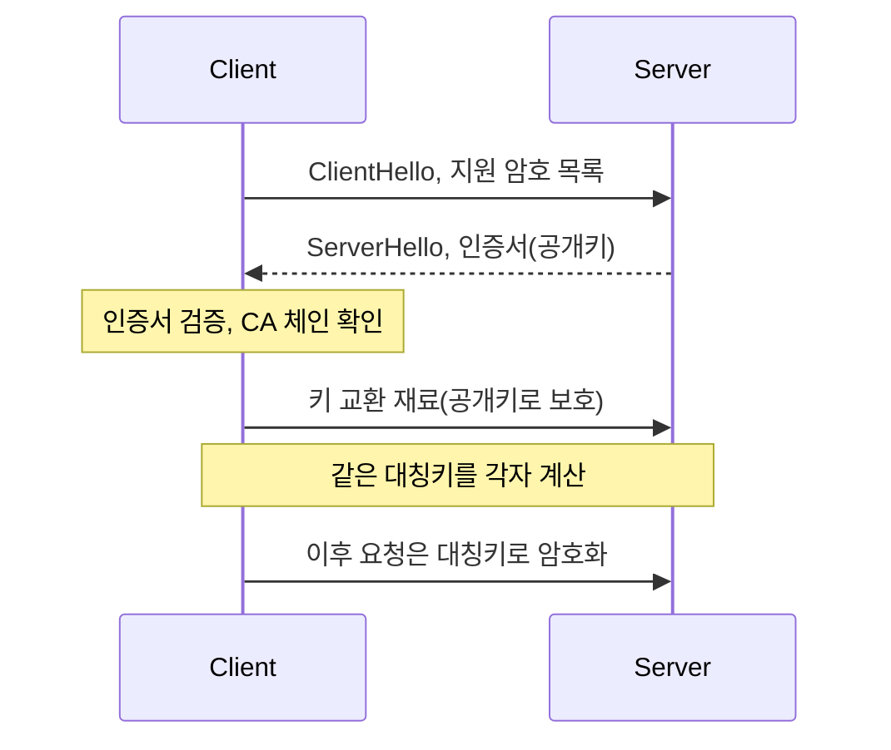

# HTTPS 와 TLS

> 대칭키를 안전하게 나눠 갖는 문제

## 이 개념을 왜 묻나

"암호화합니다"로 끝나는지, **왜 두 종류의 암호를 섞어 쓰는지**까지 말하는지 봅니다. 인증서가 무엇을 보증하는지 아는 것도 함께 확인합니다.

## 질문

### HTTPS 는 어떻게 안전한 통신을 만드나요?

답변

비대칭키로 **대칭키를 안전하게 교환하고**, 그 뒤 통신은 대칭키로 합니다.

| 구분 | 쓰는 곳 | 이유 |
|------|---------|------|
| 비대칭키 | 키 교환, 서버 인증 | 사전에 공유한 비밀 없이 시작할 수 있다 |
| 대칭키 | 실제 데이터 전송 | 비대칭보다 수백 배 빠르다 |

**판단 기준:** 비대칭키로 데이터를 다 암호화하지 않는 이유는 속도입니다. 그래서 "느린 방식으로 빠른 방식의 키를 나눠 갖는" 구조가 됩니다.

**흔한 실수:** 전 구간을 공개키로 암호화한다고 답하는 것. 그리고 HTTPS 가 서버 신원까지 보증한다는 점을 빼면 절반입니다. 암호화만으로는 상대가 진짜 그 서버인지 알 수 없습니다.

### 인증서는 무엇을 보증하나요?

답변

**이 공개키가 이 도메인의 것**이라는 사실입니다. 사이트의 안전함이나 운영자의 선의는 보증하지 않습니다.

| 검증 항목 | 내용 |
|-----------|------|
| 서명 체인 | 브라우저가 신뢰하는 루트 CA 까지 이어지는가 |
| 도메인 일치 | 접속한 도메인이 인증서에 있는가 |
| 유효 기간 | 만료되지 않았는가 |
| 폐기 여부 | CRL 또는 OCSP 로 확인 |

**흔한 실수:** 자물쇠 아이콘을 안전한 사이트로 답하는 것. 피싱 사이트도 인증서를 받을 수 있습니다. 인증서는 **연결 상대가 그 도메인임**을 말할 뿐입니다.

### TLS 1.3 이 1.2 보다 빠른 이유는?

답변

핸드셰이크 왕복이 줄었습니다.

| 버전 | 핸드셰이크 왕복 | 비고 |
|------|-----------------|------|
| TLS 1.2 | 2 | 협상 단계가 나뉘어 있다 |
| TLS 1.3 | 1 | 키 교환 재료를 첫 메시지에 함께 보낸다 |
| TLS 1.3 재개 | 0 | 이전 세션 정보로 즉시 전송 |

낡고 취약한 암호 방식을 제거해 협상할 조합 자체가 줄어든 것도 이유입니다.

**판단 기준:** 0-RTT 는 첫 요청을 재전송 공격에 노출시킬 수 있습니다. 그래서 **멱등한 요청에만** 허용하는 것이 원칙입니다.

**흔한 실수:** 0-RTT 를 항상 켜면 좋다고 답하는 것. 결제처럼 재실행되면 안 되는 요청에는 위험합니다.

## 문제로 풀어보기

## 관련 개념

- [주소를 입력하면 무슨 일이 일어나나](dns-and-request-flow.md)
- [TCP 3-way Handshake](tcp-3way-handshake.md)
