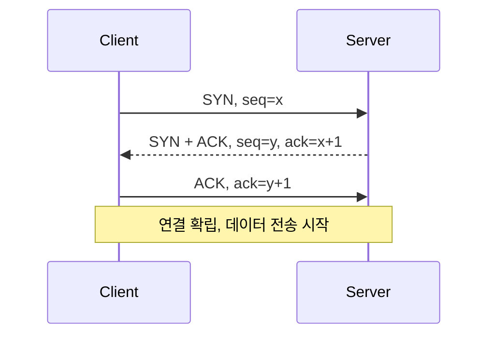

# TCP 3-way Handshake

> SYN → SYN+ACK → ACK 연결 수립 과정

## 이 개념을 왜 묻나

연결이 공짜가 아니라는 것을 아는지 봅니다. 왕복 지연, 연결 재사용, TIME_WAIT 같은 실무 주제로 이어지는 출발점입니다.

## 질문

### TCP 3-way handshake 과정을 설명해주세요

<details>
<summary>답변</summary>

서로 준비됐음을 확인하고 **순서 번호**(sequence number)를 교환하는 절차입니다.

| 단계 | 방향 | 내용 |
|------|------|------|
| 1 | 클라이언트에서 서버로 | 연결 요청(SYN). 내 시작 순서 번호를 알린다 |
| 2 | 서버에서 클라이언트로 | 요청 확인(ACK)과 자기 요청(SYN). 서버 순서 번호를 알린다 |
| 3 | 클라이언트에서 서버로 | 확인(ACK). 이 시점부터 연결이 확립된다 |



3단계는 데이터와 함께 보낼 수 있어 실제 추가 지연은 1왕복입니다.

이 과정에서 확인하는 것은 두 가지입니다. **상대가 살아 있고 받을 준비가 됐는지**, 그리고 **양쪽의 순서 번호**입니다. 순서 번호가 있어야 유실과 중복과 순서 뒤바뀜을 판별할 수 있습니다.

**흔한 실수:** 3단계에서 서버가 자리를 잡는다고 답하는 것. 서버는 **2단계에서 이미** 연결 정보를 저장하고 기다립니다. 이 성질이 SYN 홍수 공격의 표면입니다.

</details>

### 왜 2-way가 아니라 3-way인가요?

<details>
<summary>답변</summary>

양방향 모두를 확인해야 하기 때문입니다. 2단계로는 한쪽만 확인됩니다.

2단계로 끝내면 이렇게 됩니다.

| 주체 | 아는 것 |
|------|--------|
| 클라이언트 | 요청을 보냈고 확인을 받았다 |
| 서버 | 확인을 보냈다. 그것이 도착했는지는 모른다 |

서버가 확인을 보냈지만 그것이 유실됐다면, 클라이언트는 연결이 안 됐다고 보고 서버는 됐다고 봅니다. 서버는 없는 연결에 자원을 잡고 기다립니다.

또 하나는 **옛 요청이 늦게 도착하는 문제**입니다. 네트워크에서 지연된 옛 SYN 이 나중에 도착하면, 3단계 확인이 없으면 서버가 그것으로 연결을 열어버립니다. 클라이언트가 마지막에 확인해 줘야 그 연결이 지금 유효한지 판별됩니다.

**흔한 실수:** "예의상 확인한다"처럼 설명하는 것. 순서 번호 동기화와 옛 연결 요청 배제라는 구체적 목적이 있습니다.

</details>

### TCP 연결 해제 과정(4-way handshake)을 설명해주세요

<details>
<summary>답변</summary>

양쪽이 각자 "보낼 것을 다 보냈다"를 알려야 하므로 4단계입니다.

| 단계 | 방향 | 내용 |
|------|------|------|
| 1 | A에서 B로 | 종료 요청(FIN). 보낼 데이터가 끝났다 |
| 2 | B에서 A로 | 확인(ACK). 알겠다 |
| 3 | B에서 A로 | 종료 요청(FIN). 나도 다 보냈다 |
| 4 | A에서 B로 | 확인(ACK) |

2단계와 3단계가 분리된 이유는 **B가 아직 보낼 데이터가 남아 있을 수 있기 때문**입니다. A는 더 안 보내지만 받을 수는 있는 상태(반만 닫힘)가 되고, B가 남은 데이터를 다 보낸 뒤 3단계를 보냅니다.

마지막에 A는 잠시 대기 상태로 남습니다. 4단계 확인이 유실되면 B가 3단계를 재전송하므로 응답해 줘야 하고, 그 포트로 옛 패킷이 새 연결에 섞이는 것도 막습니다.

**흔한 실수:** 4단계를 3단계로 줄일 수 있다고 답하는 것. B가 보낼 것이 없으면 2와 3이 합쳐지기도 하지만, 일반적으로는 분리됩니다.

</details>

### SYN Flood 공격이란? 대응 방법은?

<details>
<summary>답변</summary>

연결 요청만 보내고 마지막 확인을 보내지 않아 **서버의 대기 자리를 채우는** 공격입니다.

```
서버는 2단계에서 연결 정보를 저장하고 기다린다
공격자는 3단계를 보내지 않는다
대기 큐가 차면 정상 요청도 거절된다
```

증상으로 구분할 수 있습니다.

| 지표 | 정상 트래픽 증가 | SYN 홍수 |
|------|---------------|---------|
| 절반만 맺힌 연결 수 | 적다 | 매우 많다 |
| 데이터 전송량 | 함께 늘어난다 | 거의 없다 |
| 출처 IP | 분포가 자연스럽다 | 매우 다양하고 재사용이 없다 |

대응은 자리를 잡지 않고 검증하는 방식입니다. 2단계 응답에 검증값을 실어 보내고, 3단계가 오면 그 값으로 정당성을 확인한 뒤 그때 자리를 만듭니다(SYN 쿠키).

**흔한 실수:** 타임아웃을 늘려 대응한다고 답하는 것. 정반대입니다. 오래 기다리면 자리가 더 오래 점유돼 상황이 악화됩니다.

</details>

## 문제로 풀어보기

[](https://learn-foundry.app/guides/network/tcp-3way-handshake?utm_source=github&utm_medium=repo&utm_campaign=oss_questions)
