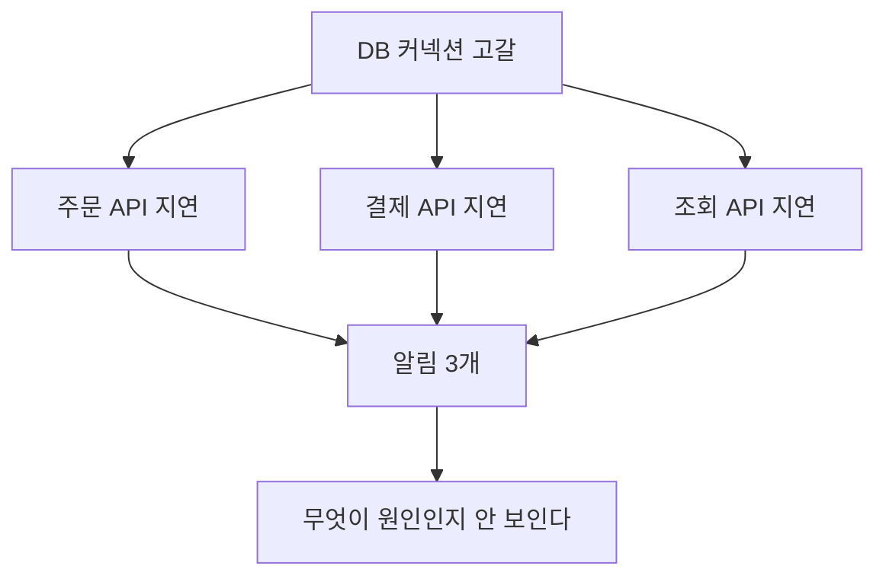

# 알림과 SLO

> 언제 사람을 깨울지 정하는 문제

## 이 개념을 왜 묻나

운영을 해본 사람인지가 드러납니다. 알림을 **많이 거는 것**이 아니라 **꺼야 할 알림을 아는 것**이 실력입니다. 무시되는 알림이 쌓인 팀은 정작 중요한 알림도 놓칩니다.

## 질문

### 어떤 기준으로 알림을 걸어야 하나요?

답변

**사용자가 아픈 것**에 겁니다. 원인이 아니라 증상에 거는 것이 원칙입니다.

| 대상 | 알림 | 이유 |
|------|------|------|
| 에러율, 응답 지연, 처리 실패 | 건다 | 사용자가 지금 아프다 |
| CPU 80%, 메모리 70% | 걸지 않는다 | 아파도 CPU 는 정상일 수 있고, CPU 가 높아도 멀쩡할 수 있다 |
| 디스크가 곧 찬다 | 건다 | 아직 안 아프지만 확실히 아프게 된다 |

CPU 에 알림을 걸면 두 방향으로 틀립니다. 놀고 있는데 배치 때문에 튀어서 깨우고, 커넥션이 말라 아픈데 CPU 는 한가해서 안 깨웁니다.

**판단 기준:** "이 알림이 왔을 때 내가 할 행동이 있는가"를 묻습니다. 없으면 알림이 아니라 대시보드에 둘 지표입니다.

**흔한 실수:** 임계값을 낮게 잡아 촘촘히 거는 것. 알림이 하루에 수십 개 오면 사람이 무시하기 시작하고, **그때부터 모든 알림이 무력해집니다.** 알림 하나를 추가할 때는 무엇을 끌지도 함께 생각해야 합니다.

### SLO 와 에러 버짓은 무엇을 결정해주나요?

답변

**얼마나 실패해도 괜찮은지를 미리 합의**해두는 것입니다. 그러면 판단이 논쟁이 아니라 계산이 됩니다.

가용성 목표를 99.9%로 두면 한 달에 허용되는 실패가 정해집니다.

| 목표 | 한 달 허용 오류 시간 |
|------|---------------------|
| 99% | 약 7시간 |
| 99.9% | 약 43분 |
| 99.99% | 약 4분 |

이 여유분이 에러 버짓입니다. 남아 있으면 배포를 계속하고, 다 썼으면 기능 배포를 멈추고 안정화에 씁니다.

**판단 기준:** 목표는 높을수록 좋은 것이 아닙니다. 99.99%는 4분이라 **사람이 대응할 시간이 없어** 자동 복구를 갖춰야 하고 비용이 급증합니다. 서비스 성격에 맞는 수치를 고르는 것이 핵심입니다.

**흔한 실수:** SLO 를 100%로 잡는 것. 도달할 수 없고, 도달하려 하면 배포를 멈추게 됩니다. **실패를 허용하지 않으면 변화도 못 합니다.**

### 장애가 났을 때 알림이 여러 개 쏟아지는 문제는 어떻게 다루나요?

답변

원인 하나가 증상 여러 개를 만들기 때문입니다. DB 가 느려지면 그 위의 모든 API 가 함께 알림을 냅니다.

| 방법 | 내용 |
|------|------|
| 묶어서 보내기 | 같은 시간대의 알림을 하나로 합친다 |
| 의존 관계로 억제 | 상위 원인 알림이 켜지면 하위 증상 알림은 보류 |
| 알림 대상 줄이기 | 사용자에게 보이는 지표에만 알림. 나머지는 대시보드 |

**판단 기준:** 알림이 쏟아지는 것은 알림 설정 문제이기도 하지만, 그만큼 **한 지점에 의존이 몰려 있다는 신호**이기도 합니다. 억제만 하고 끝내면 다음에 또 같은 일이 생깁니다.

**흔한 실수:** 알림 채널을 나눠 해결한다고 답하는 것. 채널이 늘면 각 채널이 조용해 보이지만 총량은 그대로고, 오히려 어디를 봐야 하는지 흐려집니다.

## 문제로 풀어보기

## 관련 개념

- [로그, 메트릭, 트레이스](logs-metrics-traces.md)
- [타임아웃과 재시도](../distributed-systems/timeout-retry-circuit-breaker.md)
