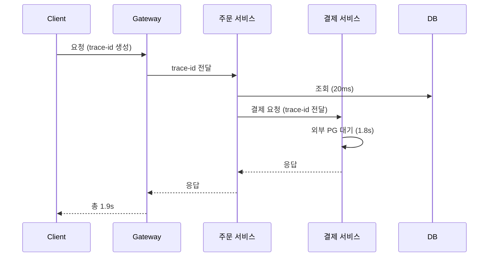

# 로그, 메트릭, 트레이스

> 세 가지 신호로 무엇을 알 수 있고 무엇을 알 수 없나

## 이 개념을 왜 묻나

장애를 겪어본 사람과 안 겪어본 사람이 가장 크게 갈립니다. 셋을 나열하는 것은 누구나 하지만, **어떤 질문에 어떤 신호를 보는지** 말할 수 있으면 실제로 디버깅해본 사람입니다.

## 질문

### 로그, 메트릭, 트레이스는 각각 어떤 질문에 답하나요?

답변

답할 수 있는 질문이 다릅니다. 하나로 다른 둘을 대신할 수 없습니다.

| 신호 | 답하는 질문 | 비용 | 못 하는 것 |
|------|-------------|------|------------|
| 메트릭 | 지금 정상인가. 언제부터 나빠졌나 | 싸다. 수치를 집계해 보관 | 어느 요청이 왜 실패했는지 모른다 |
| 트레이스 | 이 요청이 어디서 시간을 썼나 | 중간. 보통 샘플링한다 | 샘플링에서 빠진 요청은 없다 |
| 로그 | 그 순간 정확히 무슨 일이 있었나 | 비싸다. 양이 폭발한다 | 전체 경향을 못 본다 |

실제 순서는 **메트릭에서 이상을 보고, 트레이스로 구간을 좁히고, 로그로 원인을 확인**하는 것입니다. 반대로 로그부터 뒤지면 무엇을 찾는지 모르는 상태로 헤맵니다.

**판단 기준:** 셋 중 하나만 고른다면 메트릭입니다. 이상을 **감지**하지 못하면 나머지를 볼 이유조차 모릅니다.

**흔한 실수:** 로그를 많이 남기면 관측성이 좋아진다고 답하는 것. 로그만으로는 "느려졌다"를 알 수 없고, 양이 늘면 검색이 느려지고 비용이 오릅니다. 그리고 로그에 요청 식별자가 없으면 여러 서비스에 흩어진 줄을 이어붙일 수 없어 사실상 쓸 수 없습니다.

### 평균 응답 시간만 보면 무엇을 놓치나요?

답변

**느린 소수를 놓칩니다.** 평균은 꼬리를 가립니다.

100개 요청 중 95개가 50ms, 5개가 3초라면 평균은 197ms 입니다. 지표는 정상으로 보이지만 **20명 중 1명은 3초를 기다립니다.**

| 지표 | 무엇을 말하나 |
|------|---------------|
| p50 | 절반이 이보다 빠르다. 체감의 기준 |
| p95, p99 | 꼬리. 여기가 나쁘면 소수가 크게 아프다 |
| 최대값 | 한 건이라도 걸리면 튄다. 경향 판단에는 부적합 |

p99 가 중요한 이유는 화면 하나가 API 를 여러 번 호출하기 때문입니다. **10번 호출하는 화면이라면 p99 가 한 번은 걸릴 확률이 10% 에 가깝습니다.** 소수의 문제가 아니게 됩니다.

**판단 기준:** 알림은 p95 나 p99 로 걸고, 용량 산정은 p50 과 처리량으로 합니다.

**흔한 실수:** 평균과 p99 를 같이 보면 된다고 답하고 넘어가는 것. 여러 서버의 백분위를 **평균해서 합치면 틀립니다.** 백분위는 그렇게 합칠 수 없어서, 원본 분포나 히스토그램을 모아 계산해야 합니다.

### 여러 서비스에 걸친 요청이 느릴 때 어떻게 원인을 찾나요?

답변

요청 하나에 **식별자를 붙여 서비스를 넘어가며 전파**합니다. 그게 분산 트레이싱입니다.

각 구간이 얼마 걸렸는지 보면 **1.8초가 결제의 외부 호출**이라는 게 드러납니다. 로그만 보면 세 서비스의 줄이 따로 남아 이어붙일 수 없습니다.

**판단 기준:** 트레이스는 보통 샘플링합니다. 다만 **에러가 난 요청은 전부 남기는** 설정이 실무에서 유용합니다. 문제가 생긴 요청이 하필 샘플에서 빠지면 볼 것이 없습니다.

**흔한 실수:** 트레이스를 붙이면 자동으로 원인이 나온다고 답하는 것. 식별자를 전파하지 않으면 구간이 이어지지 않습니다. 비동기 큐를 건너갈 때 특히 끊기기 쉬워서, 메시지 헤더에 실어 보내야 합니다.

## 문제로 풀어보기

## 관련 개념

- [알림과 SLO](alerting-and-slo.md)
- [N+1 쿼리 문제](../database/n-plus-one.md)
