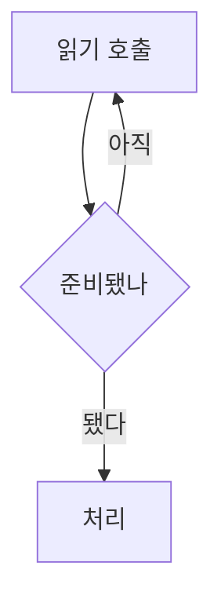

# 동기와 비동기, 블로킹과 논블로킹

> 두 축을 하나로 묶어 외우면 네 조합 중 둘을 설명할 수 없습니다

## 이 개념을 왜 묻나

네 단어를 각각 설명하는지, 아니면 두 쌍으로 뭉쳐 외웠는지가 드러납니다. 뭉쳐 외운 사람은 "논블로킹이면서 동기"인 경우에서 막힙니다.

## 질문

### 동기와 비동기, 블로킹과 논블로킹의 차이를 설명해주세요

답변

두 축이 묻는 것이 다릅니다. 블로킹과 논블로킹은 **제어권**을 바로 돌려주는지, 동기와 비동기는 **완료 통보**를 누가 챙기는지입니다.

| 축 | 묻는 것 |
|----|---------|
| 블로킹 / 논블로킹 | 호출한 함수가 제어권을 바로 돌려주는가 |
| 동기 / 비동기 | 작업이 끝났는지를 내가 확인하는가, 통보를 받는가 |

네 조합이 모두 존재합니다.

| 조합 | 동작 | 예 |
|------|------|-----|
| 블로킹 + 동기 | 끝날 때까지 멈춰 서서 기다린다 | 일반 파일 읽기 |
| 논블로킹 + 동기 | 제어권은 바로 받고, 됐냐고 계속 물어본다 | 반복 폴링 |
| 블로킹 + 비동기 | 멈춰 서지만 여러 작업을 한 번에 지켜본다 | 다중 입출력 감시 |
| 논블로킹 + 비동기 | 맡기고 진행하다 끝나면 통보를 받는다 | 콜백, 이벤트 알림 |

**판단 기준:** 가장 자주 빠지는 것이 논블로킹이면서 동기인 조합입니다. 제어권을 바로 돌려받아도 완료 여부를 내가 계속 확인해야 하면 동기입니다.

**흔한 실수:** 블로킹은 동기, 논블로킹은 비동기라고 짝지어 답하는 것. 그러면 네 조합 중 둘을 설명할 수 없습니다. 제어권과 완료 통보는 별개의 질문입니다.

### 논블로킹으로 바꿨는데 CPU만 올라가고 처리량이 그대로인 이유는?

답변

**기다림이 반복 확인으로 바뀐 것**입니다. 제어권은 돌려받았지만 완료 여부를 계속 물어보고 있으니 여전히 동기입니다.

멈춰 서서 기다리던 시간이 묻는 데 쓰는 CPU 시간으로 바뀌었을 뿐이라, 사용률만 오르고 처리량은 그대로입니다.

**판단 기준:** 이득을 얻으려면 통보를 받는 쪽으로 가야 합니다. 여러 대상을 한 번에 감시하다가 준비된 것만 처리하거나, 완료 시 호출되는 콜백을 등록합니다.

**흔한 실수:** 논블로킹으로 바꾸면 원래 CPU 사용률이 올라간다고 답하는 것. 감시나 콜백으로 가면 올라가지 않습니다. 올라간 것은 폴링 때문입니다.

### 비동기로 바꾸면 항상 빨라지나요?

답변

아닙니다. **작업 하나만 놓고 보면 걸리는 시간은 같습니다.** 이득은 기다리는 동안 다른 일을 한다는 데서 옵니다.

| 작업 성격 | 비동기 효과 |
|-----------|-------------|
| 외부 API 호출, 디스크 읽기, 데이터베이스 질의 | 크다. 대기 시간에 다른 요청을 처리한다 |
| 이미지 변환, 암호 연산 | 없다. 쉬는 구간이 없다 |
| 순서대로 세 번 호출 | 병렬로 바꾸면 크다. 비동기로만 바꾸면 작다 |

CPU 작업은 오히려 나빠질 수 있습니다. 이벤트 루프를 쓰는 구조에서 무거운 계산을 그대로 올리면 루프가 막혀 **무관한 요청까지 함께 느려집니다.**

**판단 기준:** 기다림이 병목인지 먼저 확인합니다. 코드 흐름이 나뉘어 디버깅과 예외 처리가 어려워지는 비용이 있으므로, 이득이 없는 곳에 쓰면 복잡도만 늡니다.

**흔한 실수:** 비동기를 성능 개선 기법으로만 이해하는 것. 처리량을 늘리는 기법이고 개별 지연을 줄이는 기법이 아닙니다.

### 비동기 프레임워크로 바꿨는데 효과가 없다면 무엇을 확인하나요?

답변

**체인 끝에서 끝까지 논블로킹인지** 확인합니다. 중간에 블로킹 호출이 하나라도 있으면 이득이 사라집니다.

논블로킹 구조는 적은 스레드로 많은 요청을 받는 것을 전제로 하고, 그 전제는 어떤 스레드도 오래 붙잡히지 않는다는 것입니다. 스레드가 코어 수만큼뿐인데 그것들이 모두 데이터베이스 응답에 묶이면 남는 스레드가 없습니다.

이때는 요청당 스레드 방식보다 나빠집니다. 그때는 스레드가 수백 개여서 일부가 묶여도 나머지가 일했습니다.

**판단 기준:** 드라이버가 블로킹 방식뿐이라면 그 호출만 별도 스레드 풀로 격리해 처리 스레드를 지킵니다.

**흔한 실수:** 스레드 수가 부족해서라고 답하고 늘리는 것. 코어 수만큼 두는 것이 이 구조의 정상 설정이고, 문제는 그 스레드가 블로킹 호출에 묶이는 것입니다.

## 문제로 풀어보기

## 관련 개념

- [프로세스 vs 스레드](process-vs-thread.md)
- [컨텍스트 스위칭](context-switching.md)
