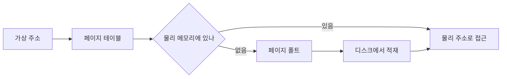
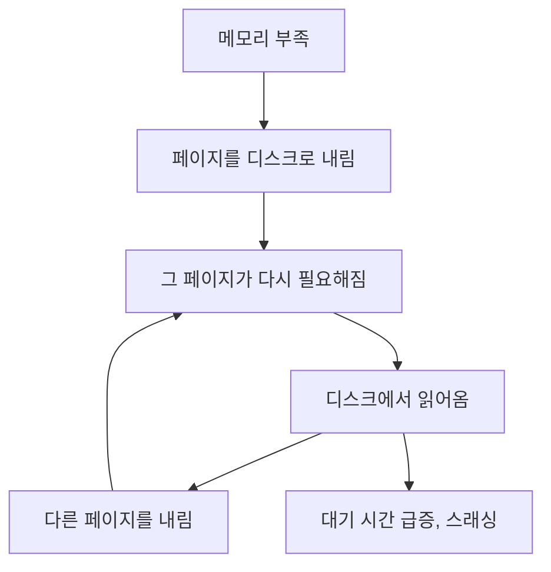

# 가상 메모리와 페이징

> 물리 메모리보다 큰 주소 공간을 쓰는 방법

## 이 개념을 왜 묻나

메모리를 배열처럼만 생각하는지, **주소가 번역된다는 것**을 아는지 봅니다. 실무에서는 스왑으로 서버가 느려지는 상황을 설명할 수 있는지로 이어집니다.

## 질문

### 가상 메모리가 무엇이고 왜 필요한가요?

답변

프로세스가 보는 주소는 **논리 주소**(가상 주소)이고, 실제 **물리 주소**로 **변환**해서 접근합니다. 프로세스마다 자기만의 연속된 주소 공간을 갖습니다.

면접관이 "논리 주소"라고 묻고 답하는 쪽은 "가상 주소"라고만 알고 있으면 서로 어긋납니다. 같은 것을 가리키는 두 이름입니다.

| 얻는 것 | 내용 |
|---------|------|
| 격리 | 다른 프로세스의 메모리를 볼 수 없다 |
| 단순한 주소 공간 | 물리 메모리가 조각나 있어도 연속으로 보인다 |
| 물리 메모리보다 큰 사용 | 안 쓰는 페이지는 디스크로 내린다 |
| 공유 | 같은 라이브러리를 여러 프로세스가 한 물리 페이지로 |

**흔한 실수:** 가상 메모리를 "디스크를 메모리처럼 쓰는 것"으로만 답하는 것. 스왑은 결과 중 하나일 뿐이고, **핵심은 주소 번역과 격리**입니다.

### 페이지 폴트가 나면 무슨 일이 일어나나요?

답변

CPU 가 예외를 일으키고 커널이 대신 처리합니다. 종류를 구분하는 게 중요합니다.

| 종류 | 상황 | 비용 |
|------|------|------|
| minor | 물리 메모리에는 있는데 매핑만 없다 | 싸다 |
| major | 디스크에서 읽어와야 한다 | 밀리초 단위로 비싸다 |
| invalid | 잘못된 주소 접근 | 프로세스 종료(segfault) |

major 폴트가 잦으면 CPU 는 한가한데 응답이 느립니다. 디스크를 기다리는 시간이라 CPU 사용률로는 안 보입니다.

**판단 기준:** 서버가 갑자기 느려졌는데 CPU 가 낮으면 major 폴트와 스왑을 봅니다.

**흔한 실수:** 페이지 폴트를 전부 오류로 답하는 것. minor 폴트는 정상 동작이고 매우 자주 일어납니다.

### 스왑이 일어나면 왜 그렇게 느려지나요?

답변

메모리와 디스크의 속도 차이가 크기 때문입니다. 그리고 **악순환**이 생깁니다.

한 번의 major 폴트가 수천 배 느린 접근이 되고, 그 대기가 다른 요청을 밀어 큐가 쌓입니다.

**판단 기준:** 데이터베이스나 캐시 서버에서는 스왑을 아예 끄거나 최소화하는 것이 일반적입니다. 느리게 동작하는 것보다 **차라리 실패하고 재시작하는 편**이 낫다는 판단입니다.

**흔한 실수:** 스왑을 늘리면 메모리 부족이 해결된다고 답하는 것. 죽지는 않지만 응답 시간이 무너져 사실상 장애입니다.

## 문제로 풀어보기

## 관련 개념

- [컨텍스트 스위칭](context-switching.md)
- [프로세스와 스레드](process-vs-thread.md)
