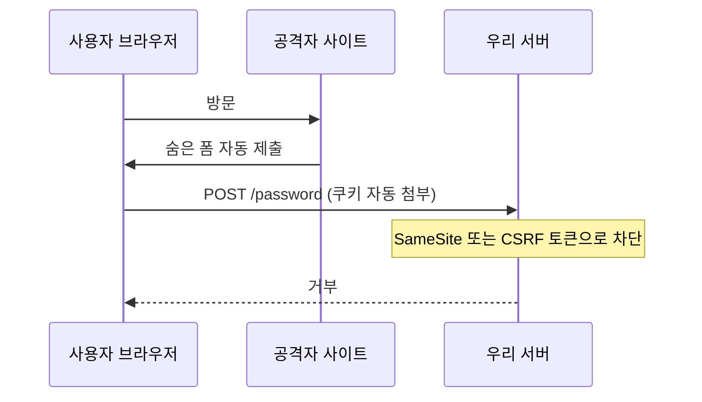

# XSS와 CSRF

> 하나는 스크립트를 심고, 하나는 남의 권한을 빌린다

## 이 개념을 왜 묻나

이름은 비슷해 보이지만 **공격 방향이 반대**입니다. 둘을 구분해 설명하지 못하면 방어책도 섞어서 답하게 됩니다. 방어가 서로 다르다는 걸 아는지 보는 질문입니다.

## 질문

### XSS와 CSRF의 차이를 설명해주세요.

답변

**XSS는 내 사이트에서 남의 스크립트가 실행되는 것**이고, **CSRF는 남의 사이트에서 내 사이트로 요청이 가는 것**입니다.

| 항목 | XSS | CSRF |
|------|-----|------|
| 공격자가 심는 것 | 스크립트 | 요청 |
| 어디서 실행되나 | 우리 사이트 안 | 다른 사이트에서 우리 쪽으로 |
| 필요한 조건 | 출력이 이스케이프되지 않음 | 사용자가 로그인 상태 |
| 훔칠 수 있는 것 | 화면의 모든 것. 토큰, 입력값 | 훔치지는 못한다. 대신 **행동**을 시킨다 |
| 주 방어 | 출력 이스케이프, CSP | SameSite 쿠키, CSRF 토큰 |

피해 크기가 다릅니다. **XSS 는 스크립트를 실행하므로 CSRF 방어를 무력화할 수 있습니다.** 페이지 안에서 CSRF 토큰을 읽어 쓰면 되기 때문입니다. 그래서 XSS 를 먼저 막습니다.

**흔한 실수:** CSRF 를 "요청을 훔쳐본다"로 답하는 것. 공격자는 응답을 읽지 못합니다(브라우저가 막습니다). 응답을 못 봐도 **되기만 하면 되는 요청**, 예를 들어 비밀번호 변경이나 송금이 표적입니다.

### XSS를 막는 방법을 순서대로 말해주세요.

답변

**출력 시점 이스케이프가 본체**이고 나머지는 보강입니다.

| 순서 | 방어 | 내용 |
|------|------|------|
| 1 | 출력 이스케이프 | 넣는 자리(HTML 본문, 속성, 스크립트, URL)에 맞춰 변환 |
| 2 | 위험한 API 회피 | `innerHTML` 대신 `textContent` |
| 3 | HTML 이 필요하면 새니타이즈 | 허용 태그만 남기는 검증된 라이브러리 사용 |
| 4 | CSP | 인라인 스크립트와 외부 출처를 제한 |
| 5 | 쿠키에 HttpOnly | 뚫려도 토큰은 스크립트가 못 읽는다 |

**입력 시점이 아니라 출력 시점**이라는 게 핵심입니다. 같은 값이 HTML 본문, 속성, JavaScript 문자열에 들어갈 때 필요한 변환이 다릅니다. 저장할 때 한 번 걸러두면 어느 자리에 쓸지 모르므로 맞출 수 없습니다.

**판단 기준:** 사용자가 서식 있는 글을 써야 하면(에디터) 이스케이프만으로는 안 되므로 새니타이즈가 필요합니다. 직접 만들지 않고 검증된 라이브러리를 씁니다.

**흔한 실수:** 입력에서 `<script>` 를 걸러 막는다고 답하는 것. `` 처럼 태그 없이도 실행되는 경로가 많습니다. 그리고 프레임워크가 자동 이스케이프해도 **`dangerouslySetInnerHTML` 같은 탈출구**를 쓰면 그 지점만 뚫립니다.

### CSRF는 어떻게 막나요?

답변

**요청이 우리 화면에서 온 것인지 확인**합니다.

| 방어 | 내용 | 한계 |
|------|------|------|
| SameSite 쿠키 | 다른 사이트에서 온 요청에 쿠키를 안 붙인다 | `Lax` 는 상위 이동 GET 에는 붙는다 |
| CSRF 토큰 | 화면에서 발급한 값을 요청에 함께 보낸다 | XSS 가 있으면 읽혀서 무력화된다 |
| Origin, Referer 확인 | 출처 헤더를 검증한다 | 헤더가 없는 경우 처리 규칙이 필요 |

`SameSite=Lax` 가 기본값으로 자리잡아 상당 부분이 막히지만, **상태를 바꾸는 요청을 GET 으로 만들면 그 방어가 통하지 않습니다.** 상태 변경은 POST 나 PUT 으로 두는 것이 방어이기도 합니다.

**판단 기준:** 쿠키 인증이면 CSRF 대비가 필요하고, `Authorization` 헤더로 토큰을 실어 보내면 자동 첨부가 없어 CSRF 표면이 크게 줄어듭니다. 그 대신 토큰을 어디 저장하느냐가 문제가 됩니다.

**흔한 실수:** 토큰을 쿠키에만 담아 검증하는 것. 쿠키는 자동으로 붙으므로 그것만으로는 출처를 구분하지 못합니다. 쿠키 값과 요청 본문(또는 헤더) 값이 **일치하는지**를 봐야 의미가 있습니다.

## 문제로 풀어보기

## 관련 개념

- [SQL 인젝션](sql-injection.md)
- [세션 인증과 JWT](../api-design/auth-session-vs-jwt.md)
